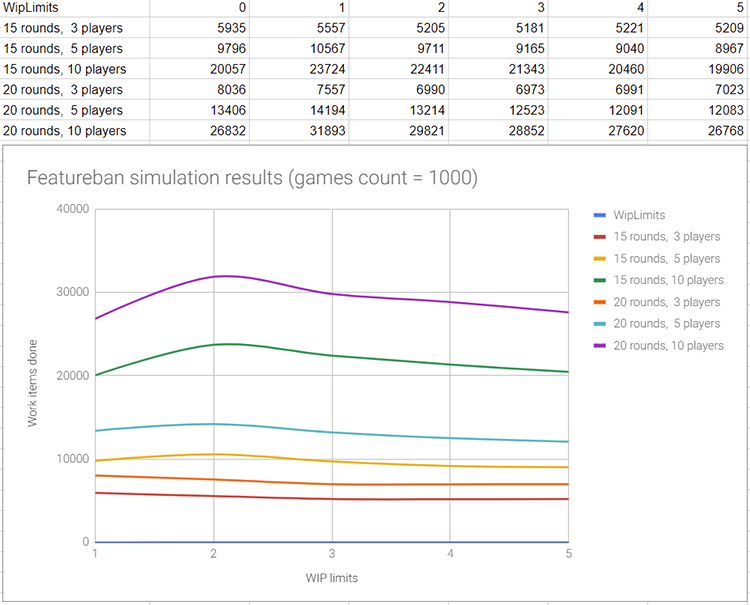

# featureban
Simple game for kanban simulation. Learning project for DodoDevSchool. Goal of the project: learn DDD on practice.

## Task
Task is to research game Featureban ([game rules](https://www.agendashift.com/featureban)) for the dependency of completed work items on WIP limits.

Input parameters:
* Players count (3, 5, 10)
* Rounds count (15, 20)
* Games count (1000)
* WIP limits (no limit, 1, 2, 3, 4, 5)

Output value:
* Average work items count in "Complete" column

## Results


## How to run
In console execute following command:
```console
dotnet Featureban.Client.dll
```
